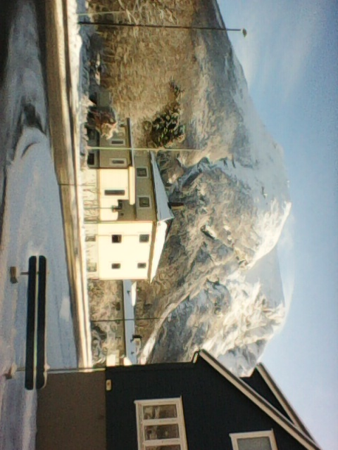
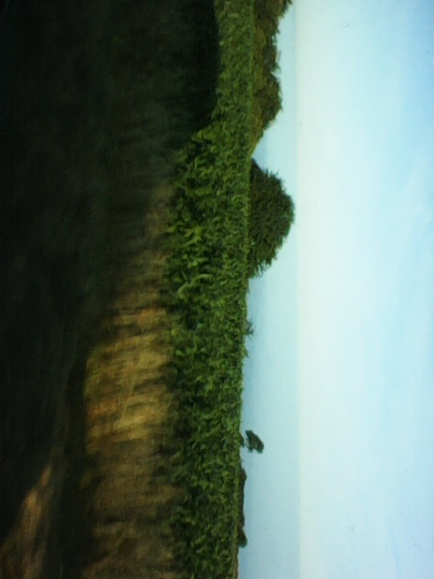

<iframe src="https://player.vimeo.com/video/650107355" frameborder="0" allow="accelerometer; autoplay; encrypted-media; gyroscope; picture-in-picture" id = "23.2.18 roti machine" allowfullscreen ></iframe>
			
<iframe src="https://player.vimeo.com/video/515758881" frameborder="0" allow="accelerometer; autoplay; encrypted-media; gyroscope; picture-in-picture" id = "23.6.10 jellyfish" allowfullscreen></iframe>

<a href="/19.html">
19

</a>

<a href="/marandluka.html">
to Mar and Luka 

</a>

<a href="/nói.html">
nói

</a>

<iframe src="https://player.vimeo.com/video/443349777" frameborder="0" allow="accelerometer; autoplay; encrypted-media; gyroscope; picture-in-picture" allowfullscreen></iframe>			

	
<a href="/blægja.html">
blægja

</a>

<a href="/18.html">
18

</a>

<a href="/betweenspaceandtime.html">
between space and time

</a>

<a href="/hungry.html">
hungry

</a>

		
<a href="/thingshumanscando.html">
things humans can do that computers can't (yet).

</a>

turning twenty

On a bus driving down a mountain in Nepal I thought I might die. I thought about the life I’ve lived so far and realised how wonderful it has been. I’m satisfied; I made peace with dying, and thought if we make it to the bottom of this road I’d be awfully thankful to get another twenty-ish years.

Doing dishes the other day I was suddenly overwhelmed with smiles and tears of joy, thinking about the beauty of the people I have met in my life so far. You all have filled my life, and I feel so lucky.

Turning twenty I’ve probably lived over a quarter of my life, and I think after-death will feel like before-birth. So I will keep trying to make the best of my brief time. Friends, thank you for the thoughts you expressed yesterday, it was humbling.

<a href="/mountainsinthesea.html">
mountains in the sea

</a>

<a href="/tianshan.html">
tian shan

</a>