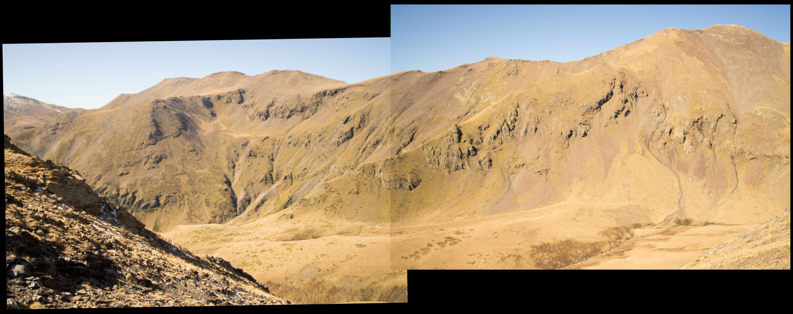
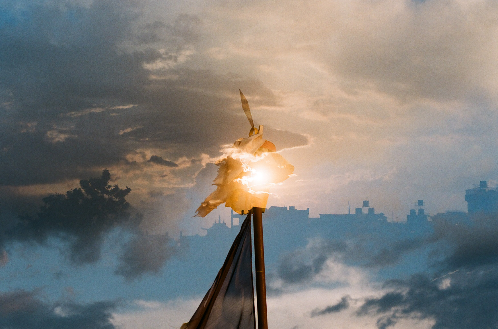

1.6.23

25.2.23

27.8.19 by a stranger

24.4.22

23.2.18 roti machine
<iframe src="https://player.vimeo.com/video/650107355" frameborder="0" allow="accelerometer; autoplay; encrypted-media; gyroscope; picture-in-picture" allowfullscreen></iframe>
			
23.6.10 jellyfish
<iframe src="https://player.vimeo.com/video/515758881" frameborder="0" allow="accelerometer; autoplay; encrypted-media; gyroscope; picture-in-picture" allowfullscreen></iframe>
			
10.9.21

26.10.19 vall de núria

<a href="stories/japan.html">
japan, summer nineteen

</a>

6.2.21

<a href="stories/dolomiti.html">
to Mar and Luka

</a>

<a href="stories/nói.html">
nói

</a>

8.10.20 biscarrosse

18.6.20 camping in jæren

X.10.16 Yehya climbs "EE" and Chris looks on

9.6.10 eisbach
<iframe src="https://player.vimeo.com/video/443349777" frameborder="0" allow="accelerometer; autoplay; encrypted-media; gyroscope; picture-in-picture" allowfullscreen></iframe>			

12.10.20 geografi<a href="#12.10.20">

26.1.19 Fish no. 1

First surfboard I ever made, out of recycled styrofoam from the fish shop. I ran out of foam so it became real short and real flat. Wasn't quite waterproof but it worked!

	
<a href="stories/blægja.html">
Blægja

</a>

31.8.19 Malie Madness

7.8.19 Kyoto bakery

3.7.20  
<a href="/ubi.html" style="font-weight: bold; font-size:400%; line-height: 100%; font-family:georgia;">faq: ubi</a>

(frequently asked questions about universal basic income)

 
2.3.20 work in progress

22.5.20 

Wouter says: "Everything in moderation, including moderation."

<a href="stories/camaret.html">
Walking along the GR34

</a>

9.3.20 4 years ago Balder and I took pictures of the stormy night sky.
<iframe src="https://www.youtube.com/embed/Bq_KskemF44" frameborder="0" allow="accelerometer; autoplay; encrypted-media; gyroscope; picture-in-picture" allowfullscreen></iframe>
				
10.11.19

X.10.17

"First I was rushing for a wait, now I'm waiting for a rush."

27.10.19 Mar in the mountains

<a href="/stories/nepal.html">
Between space and time

</a>

<a href="/stories/hungry.html">
Hungry

</a>

14.7.19 Katrine

13.7.19 Maja, Malmö, by Marci

29.7.19 by Prashant

6.7.19  
A <a href=" https://www.youtube.com/watch?v=FxDVObzf5y0">chill</a> Saturday with Leif

15.6.19  
Leif

6.5.19  
Mai, I am glad you were born.

		
<a href="/stories/thingshumanscando.html">
Things humans can do that computer's can't (yet).

</a>

9.11.18 Endlos

21.4.19 Oma, Hamburg

8.4.19 Turning twenty

On a bus driving down a mountain in Nepal I thought I might die. I thought about the life I’ve lived so far and realised how wonderful it has been. I’m satisfied; I made peace with dying, and thought if we make it to the bottom of this road I’d be awfully thankful to get another twenty-ish years.

Doing dishes the other day I was suddenly overwhelmed with smiles and tears of joy, thinking about the beauty of the people I have met in my life so far. You all have filled my life, and I feel so lucky.

Turning twenty I’ve probably lived over a quarter of my life, and I think after-death will feel like before-birth. So I will keep trying to make the best of my brief time. Friends, thank you for the thoughts you expressed yesterday, it was humbling.

 
5.4.19 Maja, Paris

10.3.19 A strange day

X.3.18 Last spring in Bir

<a href="/stories/lofoten.html">
Mountains in the Sea

</a>

21.9.18

26.1.19 Mum and Joey, Saturday morning, car is stuck

1.1.19

28.12.18

<a href="/stories/kyrgyzstan.html">
Biking across the Tian Shan in Kyrgyzstan

</a>
